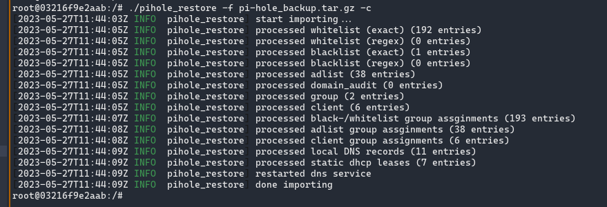

# pihole-restore

`pihole_restore` is a CLI tool to restore a Pihole Backup archive file. It can
be used in a setup where multiple Pihole servers are configured that needs
syncing from a given master configuration point. This CLI is intended to be run
on the same runtime as the target Pihole server itself. It cannot run in a
detached runtime, since it depends on being able to access the `pihole` CLI.



## Compile Time Dependencies

1. `glibc` - At most v2.28 (since the oldest pihole setup I could get my hands
   on had this version)

### Ubuntu

1. `libsqlite3-dev`

## Runtime Dependencies

1. `glibc` - At least v2.28

## Usage

```
$ pihole_restore -h
Usage: pihole_restore [OPTIONS] --file <FILE>

Options:
  -f, --file <FILE>          teleporter archive file to restore from
  -d, --database <DATABASE>  gravity db file location [default: /etc/pihole/gravity.db]
  -c, --clear                clean existing tables and files
      --filters <FILTERS>    filter which config to restore, specify in comma separated keywords [default: all]
  -h, --help                 Print help
  -V, --version              Print version
```

In a typical scenario, the following command will restore from the archive to
the `/etc/pihole/gravity.db` and the other locations inside Pihole
installation.

```
pihole_restore -f pihole-backup.tar.gz
```

If the current configuration needs to be cleared before restoring from the
archive, `-c` (`--clear`) flag can be used. Doing so will clear out the tables
and the configuration files.

By default, the following configuration is restored.

1. `blacklist` - Blacklist (exact)
1. `blacklistregex` - Blacklist (regex)
1. `whitelist` - Whitelist (exact)
1. `whitelistregex` - Whitelist (regex)
1. `adlist` - Adlists
1. `auditlog` - Audit log
1. `group` - Group
1. `client` - Client
1. `staticdhcp` - Static DHCP Leases
1. `localdns` - Local DNS Records
1. `localcname` - Local CNAME Records

If only a subset of this configuration needs to be applied, use the `--filter`
argument. For an example, to restore only the Local DNS records run,

```
pihole_restore -f <archive_file.tar.gz> --filter localdns
```

Multiple filters can be specified as a comma separated string.

```
# restore blacklist (exact), adlists, groups, and clients
pihole_restore -f <archive_file.tar.gz> --filter blacklist,adlist,group,client
```

## TODO

1. test more use cases
1. automated testing to cover most code
1. edge cases on deduplication
1. support for older glibc runtimes
1. possibility on a fully independent binary (musl C?)

## Development

Use the `makefile` target `test` to spin up a pihole Docker container. It
compiles the binary on a Debian Buster container (to link to glibc 2.28), and
copies the result to the Pihole container. Create a backup of a Pihole setup
and copy it to the `test` directory as `test/pi-hole_backup.tar.gz`.

## License

This source code and the binary is licensed under Apache v2 license. It is not
distributed with the official Pihole distribution, and it is not endorsed by
official Pihole community at this moment.
